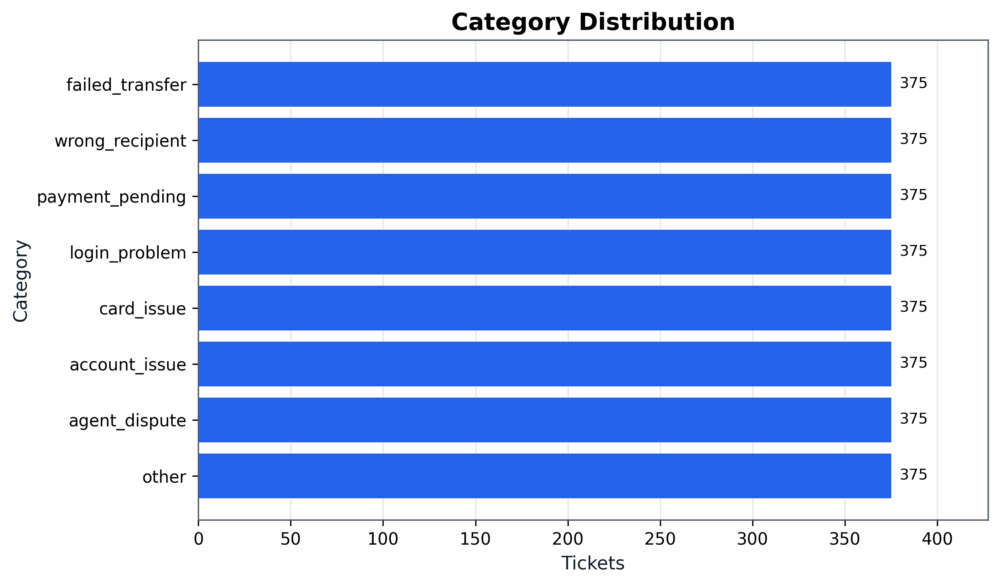
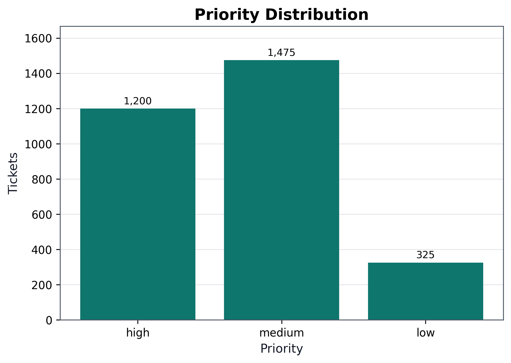
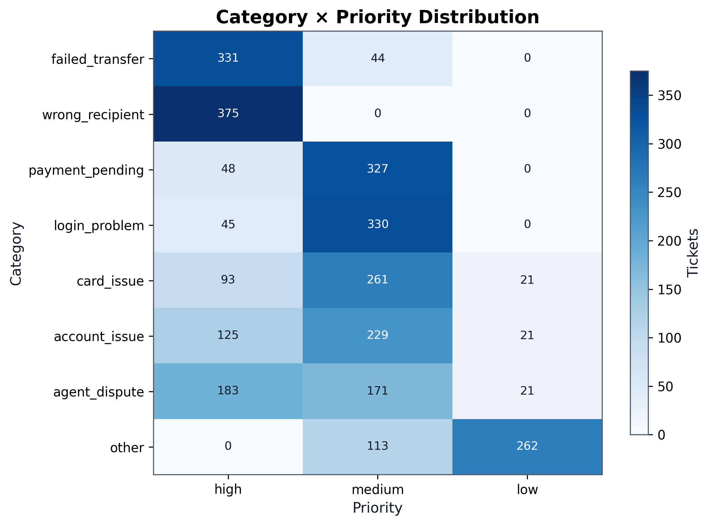
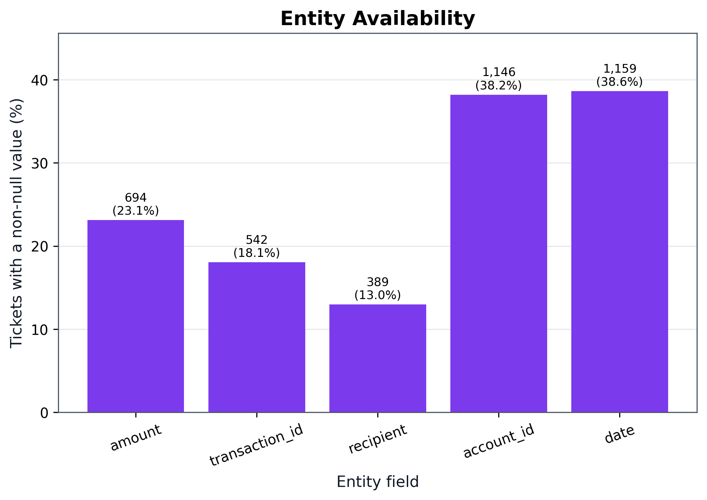
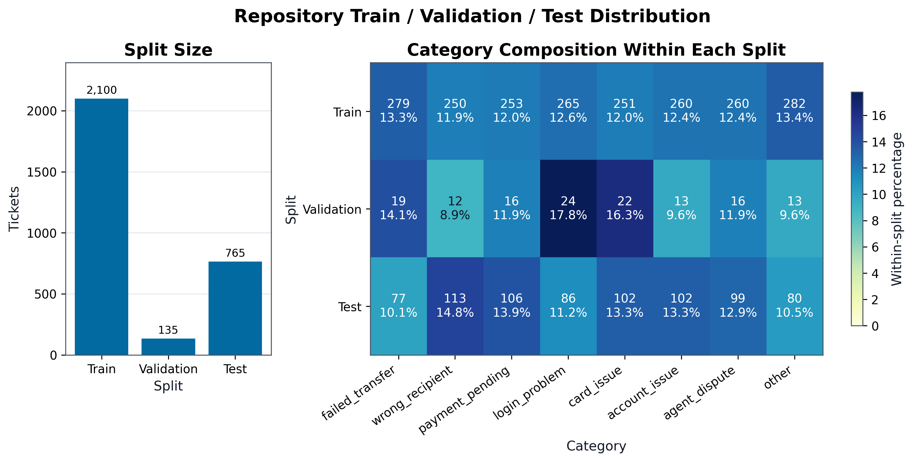

# Dataset Development and Preparation

## 1. Synthetic Dataset Generation

The project team reports that the dataset is synthetic and was generated with an LLM to resemble Iraqi wallet-support requests because real customer records could not be used. The repository does not record the generator model, prompts, or configuration.

Variation is directly observable in conversation length, character length, numeral form, and entity completeness. Tickets contain one to four messages and range from 4 to 478 combined characters. Arabic-Indic or Eastern Arabic digits occur in 22.37% of tickets, Western digits in 54.77%, and Latin letters in 27.43%. Latin-letter presence is measurable, but it is not sufficient by itself to establish Arabic-English code-switching. The data include tickets with explicit entities and tickets where some or all entity fields are null.

## 2. Dataset Structure

The file `data/iraqi_support_dataset_3000.json` is a JSON array of 3,000 tickets. Every record contains an integer `id`, a category, a priority, an ordered non-empty `messages` array, and an `expected` object. Each message contains `msg_id`, zero-based `seq`, and `text`. The eight categories are `failed_transfer`, `wrong_recipient`, `payment_pending`, `login_problem`, `card_issue`, `account_issue`, `agent_dispute`, and `other`; each has exactly 375 tickets. Priorities are `high`, `medium`, and `low`. The output entity schema is fixed to `amount`, `transaction_id`, `recipient`, `account_id`, and `date`, with null used when a value is absent.

## 3. Dataset Preparation for QLoRA Fine-Tuning

The notebook defines `SupportTicketTrainingDataset`, a custom PyTorch `Dataset`. Its length is twice the number of source tickets: `__getitem__` maps each ticket to two supervised examples, selected by index parity. Before prompt construction, all messages are validated, sorted by `seq`, required to be contiguous from zero, serialized as compact JSON, and enclosed in explicit untrusted-data delimiters. `msg_id` is not included in the model prompt.

For each example, the chat template of the configured base model (`Qwen/Qwen2.5-3B-Instruct`) renders both the prompt and the prompt-plus-assistant target. `input_ids` contain the complete rendered conversation and target. `labels` set every prompt token to `-100`, so loss is computed only over assistant-target tokens. Dynamic batch padding uses the tokenizer's pad token, an attention mask of zero for padding, and `-100` label padding. Examples are not truncated: any rendered example above `MAX_SEQUENCE_LENGTH` (2,048 by default) raises an error, preventing silent removal of target tokens. The configured QLoRA path requires a 4-bit NF4 base model and applies LoRA to the Qwen attention and MLP projection modules.

## 4. Dual-Prompt Training Design

The two dataset prompts implement different supervised tasks, not train-versus-test formatting. The structured-analysis prompt asks for one allowed category, one priority, and the five-field entity object; its target is compact JSON such as `{"category":"login_problem","priority":"medium","entities":{...}}`. The category-confidence prompt lists an A–H mapping for the same eight categories and requires exactly one code; its target is the annotated category's code.

Both prompt types are produced during training for every ticket. During inference, the structured prompt generates the operational JSON result, while the A–H prompt scores all category candidates to obtain a normalized category confidence and label-mass check. The pipeline compares the scored category with the generated JSON category and escalates conflicts, low confidence, low label mass, malformed JSON, or invalid schemas. A third prompt later in the notebook drafts an internal Iraqi-Arabic support report from an accepted prediction; it is inference-only and is not part of `SupportTicketTrainingDataset` or its QLoRA targets.

## 5. Dataset Distribution

The 3,000 tickets contain 4,170 messages. There are 2,100 single-message tickets (70.0%) and 900 multi-message tickets (30.0%); the mean is 1.39 messages and the median is 1. Combined ticket text averages 171.06 characters (median 168; range 4–478). Priority distribution is 1,200 high (40.0%), 1,475 medium (49.17%), and 325 low (10.83%). Category-by-priority counts are presented in the corresponding distribution figure.

Entity availability is: amount 694 (23.13%), transaction ID 542 (18.07%), recipient 389 (12.97%), account ID 1,146 (38.20%), and date 1,159 (38.63%). The remaining values are null; exact missing counts and rates are recorded in `artifacts/dataset_statistics.json`.

## 6. Dataset Validation and Splits

All records pass the repository-derived schema checks. No duplicate ticket IDs, duplicate message IDs, exact duplicate message texts, or lowercase/whitespace-normalized duplicate texts were found.

The notebook creates a sequential split from the dataset's existing order: the first 2,100 tickets are training data (70.0%); the first 765 tickets from the remainder are test data (25.5% of the full dataset); and the final 135 are validation data (4.5%). The test loop evaluates all 765 test tickets, corresponding to IDs 2101–2865. Because the split operates on whole records before `SupportTicketTrainingDataset` expands each record into two examples, the two prompt variants from a ticket remain in the same partition.

The supplementary character-length figure is available at `artifacts/dataset_figures/05_ticket_text_length_distribution.png`.
